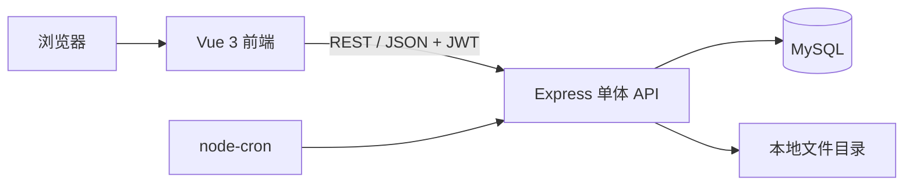
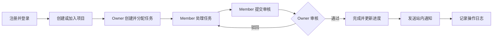
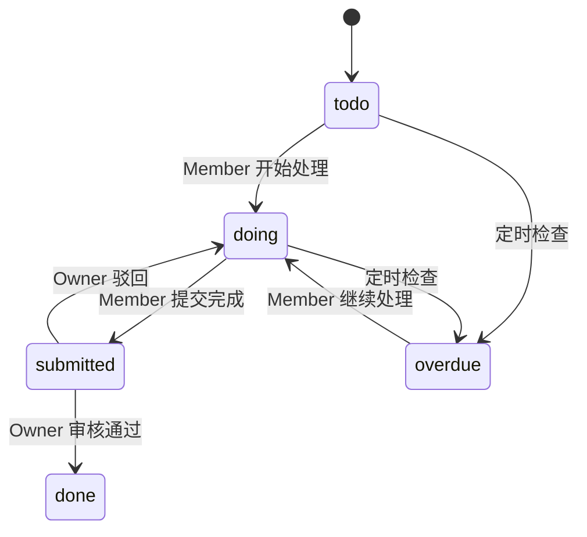

# 架构说明

## 1. 文档目标

本文档定义“实验室 / 工作室项目协作管理平台”第一版的系统边界、模块职责、分层规则和关键业务流程。后续开发应先确定所属模块，再按照本文档拆分前后端代码。

当前阶段只做设计，不包含业务代码。

## 2. 技术栈与范围

### 2.1 固定技术栈

- 前端：Vue 3、TypeScript、Vite、Vue Router、Pinia、Axios、Element Plus、ECharts
- 后端：Node.js、Express、TypeScript、JWT、Multer、node-cron
- 数据库：MySQL

### 2.2 第一版形态

- 前后端分离的单体 Web 应用。
- 后端提供 REST API，前端通过 Axios 调用。
- MySQL 保存业务数据，文件本体保存在服务端文件目录，MySQL 只保存文件元数据。
- JWT 负责登录认证，项目角色负责项目内授权。
- 站内通知通过普通 HTTP 接口查询，不做实时推送。
- node-cron 每日执行逾期任务检查。

### 2.3 第一版明确不做

- WebSocket
- 消息队列
- 微服务和 DDD
- 复杂组织架构
- 第三方登录
- 手机验证码
- 管理员后台或管理员角色

## 3. 总体架构



后端是一个进程内的模块化单体。模块之间通过 service 调用协作，不通过消息队列或跨服务通信。

## 4. 身份与权限模型

系统只有普通注册用户，角色仅存在于具体项目中。

| 场景 | Owner | Member |
| --- | --- | --- |
| 查看项目、成员、文件和进度 | 允许 | 允许 |
| 编辑、归档项目 | 允许 | 禁止 |
| 生成邀请码、移除成员 | 允许 | 禁止 |
| 创建、编辑和分配任务 | 允许 | 禁止 |
| 处理并提交自己的任务 | 可查看和管理 | 允许 |
| 审核或驳回任务 | 允许 | 禁止 |
| 评论 | 允许 | 允许 |
| 上传项目文件 | 允许 | 禁止 |
| 上传任务附件 | 允许 | 允许 |

项目负责人 Owner 的判断统一以 `projects.owner_user_id` 为准，不以 `project_members.role` 作为最终依据；普通成员关系通过 `project_members` 校验。

前端权限只负责菜单、页面入口和按钮的展示或隐藏，不构成安全控制。后端 service 必须兜底查询项目负责人、成员关系和资源所属项目，并在执行操作前完成权限校验。

## 5. 业务模块边界

| 模块 | 核心职责 | 主要依赖 |
| --- | --- | --- |
| auth | 注册、登录、JWT 签发、当前用户 | users |
| users | 个人资料、密码修改、个人任务统计入口 | auth |
| projects | 项目创建、编辑、归档、邀请码 | users |
| members | 加入项目、成员列表、移除成员、角色判断 | projects、users |
| tasks | 创建分配、状态流转、提交、审核、筛选 | projects、members |
| comments | 任务评论的新增、查询和删除 | tasks、members |
| files | Owner 上传项目文件；项目成员上传任务附件；文件查询、下载和删除 | projects、tasks、members |
| notifications | 站内通知、未读数量、已读状态 | users、projects、tasks |
| stats | 项目进度、成员完成率、个人任务统计 | projects、tasks、members |
| logs | 关键业务操作追踪 | users、projects、tasks |

依赖原则：业务模块可以调用其他模块公开的 service，不直接访问其他模块的 repository；通知和日志由触发业务动作的 service 在同一业务流程中写入。

## 6. 后端分层

后端按业务模块组织，每个模块建议包含：

```text
src/modules/tasks/
  tasks.routes.ts
  tasks.controller.ts
  tasks.service.ts
  tasks.repository.ts
  tasks.validator.ts
  tasks.types.ts
```

分层职责：

- routes：声明路径、中间件和 controller。
- controller：读取请求参数，调用 service，返回统一响应。
- service：权限判断、业务规则、事务边界、状态流转、通知和日志协调。
- repository：仅执行本模块数据库查询，不做权限和业务判断。
- validator：校验请求参数和格式。
- types：维护模块内 TypeScript 类型。
- middleware：统一处理认证、通用错误和请求上下文。

## 7. 前端分层

前端按功能模块组织，请求与页面解耦：

```text
src/
  views/
  components/
  api/
  stores/
  router/
  types/
  utils/
```

- views：页面级组件，只组合交互和展示。
- components：跨页面复用的表单、表格、卡片和弹窗。
- api：按模块封装 Axios 请求。
- stores：保存登录态、用户信息、当前项目和通知数量等全局状态。
- router：路由定义、登录守卫和页面级权限入口。
- types：统一接口模型、状态枚举和分页类型。
- utils：无业务含义的通用函数。

## 8. 核心业务流程

### 8.1 项目协作闭环



### 8.2 任务状态

固定状态值：`todo`、`doing`、`submitted`、`done`、`overdue`。



状态流转只能由 tasks service 校验和执行，Member 不能直接把任务改为 `done`。

### 8.3 项目归档

项目归档后仍可查询，但禁止新增或编辑任务、分配任务、提交任务以及继续写入项目协作内容。归档校验由相关业务 service 统一执行。

## 9. 横切约定

- 认证：除注册和登录外，业务接口默认要求有效 JWT。
- 授权：Owner 以 `projects.owner_user_id` 判断；Member 通过 `project_members` 判断；前端只控制展示，后端 service 必须校验角色和资源归属。
- 响应：统一使用 `code`、`message`、`data`。
- 分页：统一使用 `list`、`total`、`page`、`pageSize`。
- 错误：参数、认证、权限、资源不存在、状态冲突使用不同错误码。
- 事务：创建项目及 Owner 关系、加入项目、任务审核等多表操作必须使用事务。
- 时间：数据库保存统一时区的时间，接口使用 ISO 8601 字符串。
- 日志：只记录创建项目、加入项目、成员管理、任务流转、文件上传和项目归档等关键动作。

## 10. 文档关系

- [DATABASE.md](DATABASE.md)：定义实体、字段、约束和索引。
- [API.md](API.md)：定义接口路径、权限和请求响应契约。
- [TODO.md](TODO.md)：定义后续按模块实施的顺序和验收项。
- [DEV_LOG.md](DEV_LOG.md)：记录文档和代码的实际变更。
