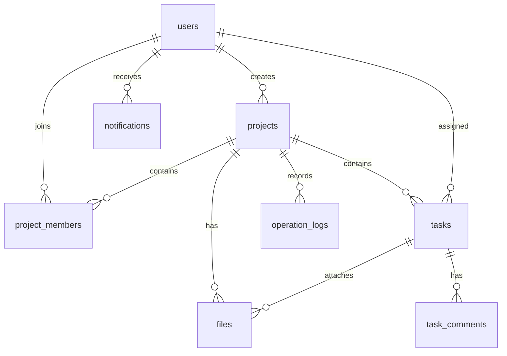

# 数据库设计说明

## 1. 文档目标

本文档定义第一版 MySQL 数据模型、字段、关系、状态和约束。后续迁移脚本、repository 和接口字段必须与本文档一致；若模型发生变化，应先更新本文档。

第一版数据库迁移已建立，实际表结构必须同时遵守本文档和
`server/migrations/001_initial_schema.sql`。后续变更应先更新本文档，再新增迁移，
不得直接修改已执行的历史迁移。

## 2. 命名与通用规则

- 表名使用小写复数形式，字段名使用 `snake_case`。
- 主键统一为 `id`，外键统一为 `xxx_id`。
- 主键建议使用 `BIGINT UNSIGNED`。
- 核心表均包含 `created_at` 和 `updated_at`。
- 业务时间使用 `DATETIME`，由应用统一处理时区。
- 字符集使用 `utf8mb4`，存储引擎使用 InnoDB。
- 外键字段必须建立索引；唯一业务关系使用唯一索引保护。
- `project_members.role` 只允许小写值 `owner` 和 `member`。
- 第一版邀请码直接保存在 `projects.invite_code`，不建立独立邀请表。

## 3. 实体关系



## 4. 表结构

字段类型是第一版建议值，实际建表时不得无文档新增业务字段。

### 4.1 users

保存系统用户资料，不保存项目角色。

| 字段 | 类型 | 必填 | 说明 |
| --- | --- | --- | --- |
| `id` | BIGINT UNSIGNED | 是 | 主键 |
| `username` | VARCHAR(50) | 是 | 登录名，唯一 |
| `password_hash` | VARCHAR(255) | 是 | 密码哈希，不保存明文 |
| `nickname` | VARCHAR(50) | 是 | 用户昵称 |
| `avatar_url` | VARCHAR(500) | 否 | 头像地址 |
| `email` | VARCHAR(100) | 否 | 邮箱，第一版不用于第三方登录 |
| `phone` | VARCHAR(20) | 否 | 手机号资料，第一版不做验证码 |
| `direction` | VARCHAR(50) | 否 | 前端、后端、测试等方向 |
| `created_at` | DATETIME | 是 | 创建时间 |
| `updated_at` | DATETIME | 是 | 更新时间 |

约束：`username` 唯一；如填写 `email`，建议使用普通索引支持查询。

### 4.2 projects

保存项目基本信息和当前邀请码。

| 字段 | 类型 | 必填 | 说明 |
| --- | --- | --- | --- |
| `id` | BIGINT UNSIGNED | 是 | 主键 |
| `name` | VARCHAR(100) | 是 | 项目名称 |
| `description` | TEXT | 否 | 项目描述 |
| `owner_user_id` | BIGINT UNSIGNED | 是 | 创建项目的 Owner |
| `status` | VARCHAR(20) | 是 | `active`、`finished`、`archived` |
| `start_date` | DATE | 否 | 开始日期 |
| `end_date` | DATE | 否 | 截止日期 |
| `invite_code` | VARCHAR(32) | 是 | 当前邀请码，唯一 |
| `archived_at` | DATETIME | 否 | 归档时间 |
| `created_at` | DATETIME | 是 | 创建时间 |
| `updated_at` | DATETIME | 是 | 更新时间 |

约束：`invite_code` 唯一；`owner_user_id` 关联 `users.id`，并作为项目负责人的唯一判断依据；项目创建时必须同时写入一条 `role=owner` 的成员关系。

### 4.3 project_members

保存用户在具体项目中的角色。

| 字段 | 类型 | 必填 | 说明 |
| --- | --- | --- | --- |
| `id` | BIGINT UNSIGNED | 是 | 主键 |
| `project_id` | BIGINT UNSIGNED | 是 | 关联项目 |
| `user_id` | BIGINT UNSIGNED | 是 | 关联用户 |
| `role` | VARCHAR(20) | 是 | 仅小写值 `owner`、`member` |
| `joined_at` | DATETIME | 是 | 加入项目时间 |
| `created_at` | DATETIME | 是 | 创建时间 |
| `updated_at` | DATETIME | 是 | 更新时间 |

约束：`project_id + user_id` 唯一；数据库不对 `role=owner` 设置唯一约束，项目负责人始终以 `projects.owner_user_id` 为准；第一版不支持转让 Owner。

### 4.4 tasks

保存任务、分配关系和审核结果。

| 字段 | 类型 | 必填 | 说明 |
| --- | --- | --- | --- |
| `id` | BIGINT UNSIGNED | 是 | 主键 |
| `project_id` | BIGINT UNSIGNED | 是 | 所属项目 |
| `title` | VARCHAR(150) | 是 | 任务标题 |
| `description` | TEXT | 否 | 任务描述 |
| `assignee_user_id` | BIGINT UNSIGNED | 是 | 任务负责人，必须是项目成员 |
| `creator_user_id` | BIGINT UNSIGNED | 是 | 创建人，第一版必须是 Owner |
| `priority` | VARCHAR(20) | 是 | `low`、`medium`、`high`、`urgent` |
| `status` | VARCHAR(20) | 是 | 默认 `todo` |
| `tag` | VARCHAR(30) | 否 | 单个可选标签 |
| `due_at` | DATETIME | 否 | 截止时间 |
| `submit_content` | TEXT | 否 | Member 提交任务时填写的完成说明 |
| `rejection_reason` | VARCHAR(500) | 否 | 最近一次驳回原因 |
| `submitted_at` | DATETIME | 否 | 最近一次提交时间 |
| `reviewer_user_id` | BIGINT UNSIGNED | 否 | 最近一次审核人，关联 `users.id` |
| `reviewed_at` | DATETIME | 否 | 最近一次审核时间 |
| `completed_at` | DATETIME | 否 | 审核通过时间 |
| `created_at` | DATETIME | 是 | 创建时间 |
| `updated_at` | DATETIME | 是 | 更新时间 |

约束：任务状态仅允许 `todo`、`doing`、`submitted`、`done`、`overdue`；任务负责人必须属于同一项目。

### 4.5 task_comments

评论只属于任务，不设计聊天室或评论回复树。

| 字段 | 类型 | 必填 | 说明 |
| --- | --- | --- | --- |
| `id` | BIGINT UNSIGNED | 是 | 主键 |
| `task_id` | BIGINT UNSIGNED | 是 | 所属任务 |
| `user_id` | BIGINT UNSIGNED | 是 | 评论人 |
| `content` | TEXT | 是 | 评论内容 |
| `created_at` | DATETIME | 是 | 创建时间 |
| `updated_at` | DATETIME | 是 | 更新时间 |

### 4.6 files

统一保存项目文件和任务附件的元数据，文件本体不写入 MySQL。

| 字段 | 类型 | 必填 | 说明 |
| --- | --- | --- | --- |
| `id` | BIGINT UNSIGNED | 是 | 主键 |
| `project_id` | BIGINT UNSIGNED | 是 | 所属项目 |
| `task_id` | BIGINT UNSIGNED | 否 | 所属任务，为空表示项目文件 |
| `uploader_user_id` | BIGINT UNSIGNED | 是 | 上传人 |
| `original_name` | VARCHAR(255) | 是 | 用户上传的原始文件名 |
| `stored_name` | VARCHAR(255) | 是 | 服务端保存文件名 |
| `storage_path` | VARCHAR(500) | 是 | 相对存储路径 |
| `size_bytes` | BIGINT UNSIGNED | 是 | 文件大小 |
| `mime_type` | VARCHAR(100) | 是 | MIME 类型 |
| `category` | VARCHAR(20) | 是 | `project` 或 `task` |
| `created_at` | DATETIME | 是 | 创建时间 |
| `updated_at` | DATETIME | 是 | 更新时间 |

约束：`category=project` 时 `task_id` 为空；`category=task` 时 `task_id` 必填且任务属于同一项目。

### 4.7 notifications

保存站内通知及其已读状态。

| 字段 | 类型 | 必填 | 说明 |
| --- | --- | --- | --- |
| `id` | BIGINT UNSIGNED | 是 | 主键 |
| `receiver_user_id` | BIGINT UNSIGNED | 是 | 接收人 |
| `project_id` | BIGINT UNSIGNED | 否 | 关联项目 |
| `task_id` | BIGINT UNSIGNED | 否 | 关联任务 |
| `type` | VARCHAR(30) | 是 | `project`、`task`、`review`、`overdue`、`system` |
| `title` | VARCHAR(150) | 是 | 通知标题 |
| `content` | VARCHAR(500) | 是 | 通知内容 |
| `is_read` | TINYINT(1) | 是 | 默认 0 |
| `read_at` | DATETIME | 否 | 阅读时间 |
| `created_at` | DATETIME | 是 | 创建时间 |
| `updated_at` | DATETIME | 是 | 更新时间 |

### 4.8 operation_logs

记录关键业务动作，不记录普通页面访问。

| 字段 | 类型 | 必填 | 说明 |
| --- | --- | --- | --- |
| `id` | BIGINT UNSIGNED | 是 | 主键 |
| `operator_user_id` | BIGINT UNSIGNED | 否 | 操作人，系统任务可为空 |
| `project_id` | BIGINT UNSIGNED | 否 | 关联项目 |
| `task_id` | BIGINT UNSIGNED | 否 | 关联任务 |
| `module` | VARCHAR(30) | 是 | 业务模块 |
| `action` | VARCHAR(50) | 是 | 动作标识 |
| `target_type` | VARCHAR(30) | 是 | 目标类型 |
| `target_id` | BIGINT UNSIGNED | 否 | 目标 ID |
| `target_name` | VARCHAR(150) | 否 | 操作发生时的目标名称快照 |
| `description` | VARCHAR(500) | 是 | 可展示的操作描述 |
| `ip_address` | VARCHAR(45) | 否 | IPv4 或 IPv6 |
| `created_at` | DATETIME | 是 | 创建时间 |
| `updated_at` | DATETIME | 是 | 更新时间 |

## 5. 状态与流转

### 5.1 项目状态

- `active`：进行中
- `finished`：已完成
- `archived`：已归档

### 5.2 任务状态

- `todo`：待开始
- `doing`：进行中
- `submitted`：待审核
- `done`：已完成
- `overdue`：已逾期

允许的业务流转：`todo -> doing -> submitted -> done`；审核驳回为 `submitted -> doing`；定时任务可将到期未完成的 `todo` 或 `doing` 标记为 `overdue`；Member 可将 `overdue -> doing` 后继续处理。

## 6. 索引建议

- 唯一索引：`users.username`、`projects.invite_code`、`project_members(project_id, user_id)`。
- 项目查询：`projects.owner_user_id`、`project_members.user_id`。
- 任务筛选：`tasks(project_id, status)`、`tasks(assignee_user_id, status)`、`tasks.due_at`。
- 详情关联：`task_comments.task_id`、`files.project_id`、`files.task_id`。
- 通知查询：`notifications(receiver_user_id, is_read, created_at)`。
- 日志查询：`operation_logs(project_id, created_at)`、`operation_logs(task_id, created_at)`。

## 7. 事务与删除策略

- 创建项目：同时写入 `projects` 和 Owner 的 `project_members`，必须使用事务。
- 加入项目：校验邀请码并写入成员关系，依赖唯一约束防止重复加入。
- 提交与审核：任务状态、通知和操作日志应在同一事务中完成。
- 移除成员：若成员仍有未完成任务，第一版应拒绝移除并返回明确错误。
- 项目归档：采用状态归档，不物理删除项目及其历史数据。
- 用户、任务、通知和日志第一版不提供物理删除接口；评论和文件删除必须先校验权限及资源归属。

## 8. 第一版不建模

- 管理员和复杂组织架构表
- WebSocket 会话与消息队列表
- 第三方登录账号绑定表
- 手机验证码表
- 文件版本表
- 任务工时、绩效和甘特图相关表

## 9. 初始化迁移

- 数据库名：`labflow`。
- 首个迁移文件：`server/migrations/001_initial_schema.sql`。
- 目标环境：MySQL 8.0+，字符集 `utf8mb4`，存储引擎 InnoDB。
- 在 Navicat 中打开迁移文件并对有建库权限的 MySQL 连接执行，随后刷新连接，
  即可看到 `labflow` 及本文档定义的 8 张表。
- 脚本使用 `CREATE DATABASE IF NOT EXISTS` 和 `CREATE TABLE IF NOT EXISTS`，
  可以避免重复执行时直接报“对象已存在”；但它不会自动修复同名旧表的字段差异。

执行后可用以下语句核对：

```sql
USE labflow;
SHOW TABLES;
```

预期表：`users`、`projects`、`project_members`、`tasks`、`task_comments`、
`files`、`notifications`、`operation_logs`。
